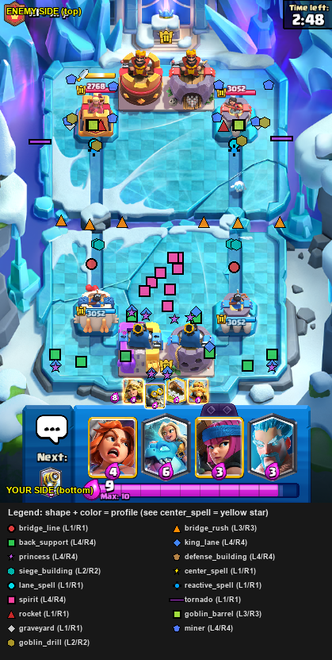

# Card placement zones

The bot picks a **play group** for each detected card, then taps a random point from that group’s left or right lane (`PLAY_COORDS` in `pyclashbot/bot/card_detection.py`).

## Reference map

- **Your side** is the **bottom** of the image; **enemy** is the top.
- **Shape + color** = play group (see legend at the bottom of the image).
- Example: yellow **stars** = `center_spell`; red **circles** = `bridge_line`; pink **squares** = `spirit` (uses building coords on your side).

## Play groups (summary)

| Group | Arena area |
|-------|------------|
| `king_lane` | Deep lane / behind king |
| `princess` | Princess lane |
| `bridge_line` | Bridge line (tanks, heavies) |
| `bridge_rush` | In front of bridge |
| `back_support` | Behind bridge |
| `defense_building` | Back-field buildings |
| `siege_building` | Mortar / X-Bow |
| `center_spell` | Center behind river |
| `lane_spell` | Standard spell lane |
| `reactive_spell` | Reactive spells (Zap, Void, Clone, Rage, Vines, …) |
| `spirit` | Spirits (your side; coords match `defense_building` for now) |
| `rocket`, `tornado`, `goblin_barrel`, `graveyard`, `miner`, `goblin_drill` | Card-specific |

Full card → group list lives in `CARD_GROUPS` in `card_detection.py` (176 ids including pre-fingerprint evo/hero variants).
